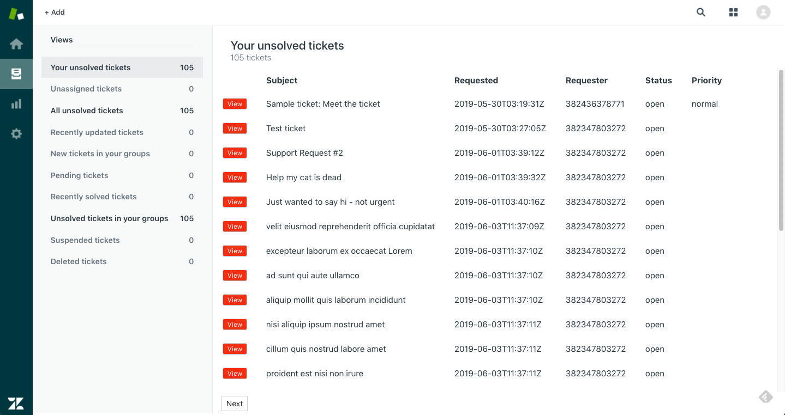
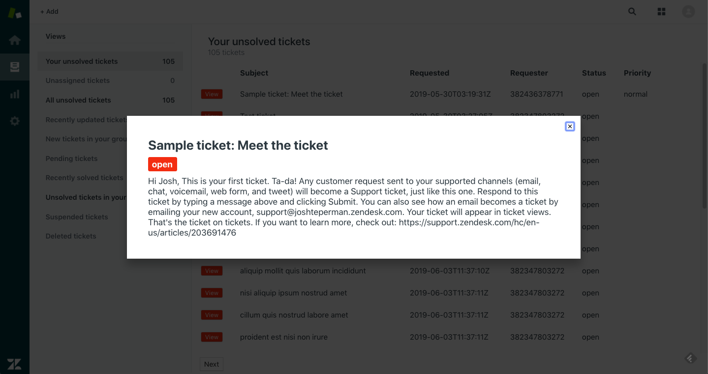
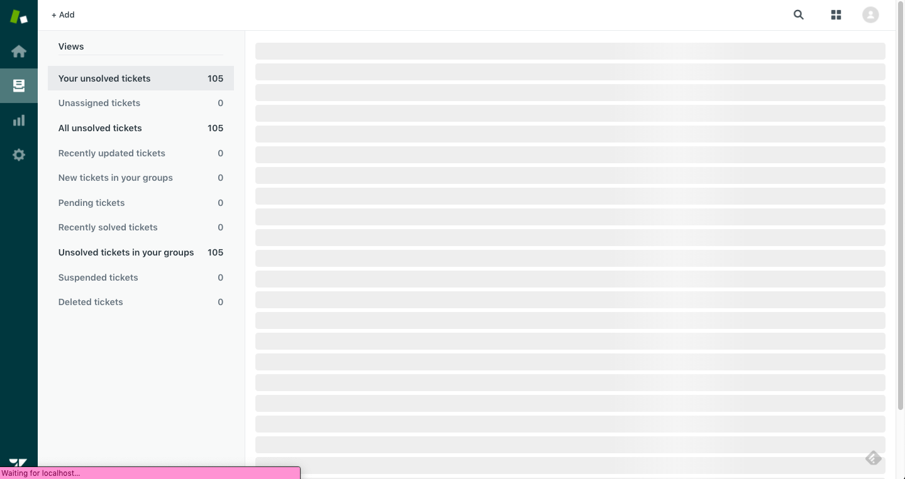
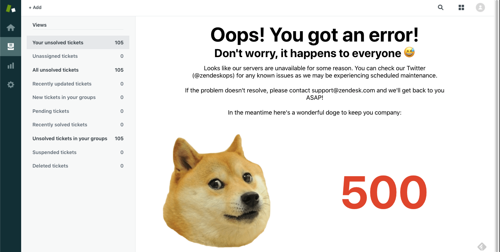

# Zendesk Ticket Viewer

# About this Project

This project was a coding challenge written to apply for a Software Engineering Internship at Zendesk. The challenge was to create an application in any language that would retrieve ticketing data from the Zendesk API, and dispay that data in a web or CLI application. 

At the time of receiving this challenge I had just completed learning Ruby on Rails and had learned a small amount of Vanilla Javascript so was originally planning to write a solution in ruby, however after reading the requirements for the challenge I felt Rails would be unnecessarily heavy duty, and a static, single-page web application written in Javascript would be most appropriate.

Given we had a full week to submit our application, I decided to learn Node Server, Express.js, React.js and the Jest testing suite for this project. Worst-case scenario I would learn an in-demand development stack that I was going to learn at some point anyway, and I felt challenging myself to learn something new would mirror the types of real world challenges developers face in the industry. 

# Installation instructions

### Step 1: Setting up the project locally

1. To clone the repo to your local machine, navigate to the the directory you want to folder to be located in, and execute `git clone https://github.com/JoshTeperman/zendesk-app.git` in console. Alternatively, download the project as a zip file and extract the entire folder to your chosen directory.
2. To install server dependencies, run either `yarn install` or `npm install` from the root of the project.
3. To install client dependencies, cd into the `/client` folder and run either `yarn install` or `npm install`

### Step 2: Starting the backend server

4. Navigate to the root directory and run `nodemon start` in the terminal. You should see a console message saying `Server is running on port 5000`, indicating that the server is running.

### Step 3: Start the Front end server

5. Navigate to the `/client` directory and run either `yarn start` or `npm start`. This should start the react development server on an available port.

### Step 4: Starting the app

6. If your browser doesn't load the page automatically, navigate to `http://localhost:3000/tickets` in the browser of your choice.

# Configuration

## Installing Node.js

To get started, you'll need to have the latest version of Node and npm/yarn installed on your computer. You can download Node directly from the official website: https://nodejs.org/en/download/, or use a package manager. For example if you are using brew, run `brew install node` in the console. 

## Authentication & Security

Since this application uses Zendesk's Ticketing API, it requires a username and password and either OAuth or Basic Authentication to secure HTTP requests between their API and our server. I've configured the app using Basic Auth and my credentials, but if they are expired you'll need to create your own trial account: (https://www.zendesk.com/register/) and replace the authentication password and email in the .env file to your login credentials. Please note that I've chosen to upload the entire project, including the .env file to GitHub to make them available to the Zendesk team, however you may wish to hide your credentials by adding .env to git-ignore.

## Dependencies

Your npm modules will be installed automatically when you run `npm install`. View the package.json files in root directory and client directory for a full list.

# Application Description

## How it works:

This is a static single-page application that requests the ticket data for the user specified by their authentication credentials. On loading the web page, the React Client loads and mounts the container App Component and makes a fetch request to the backend API for ticket data.

This request is routed to an axios get request that uses Basic Authentication to contact the Zendesk API and return either the first 25 tickets for that account in a JSON object, or an error status, either of which are then sent to the React Client. If the result is an error, the error code and error page are rendered in the browser, otherwise the ticket data is parsed to a useable format and rendered in the browser in a table. Clicking on 'View' for each ticket will display individual ticket descriptions in a modal. Clicking the exit button, pressing 'Esc' key, or clicking outside the modal window will close the modal. 

If the user account has more than 25 tickets in total, the client will dynamically create pagination buttons for each subsequent 25 tickets, and display the total number of tickets in the Header Component at the top of the page. Clicking the 'Next' or 'Prev' pagination buttons will send another HTTP POST request with the next_page or pre_page url to the backend, following the same process to contact Zendesk, retrieve the data, and display in the browser. 

## Architecture

The software is separated into two main sections:

- Backend Node.js API / server written with the Express.js module that routes client requests and in turn uses AXIOS to make requests for tickets to the Zendesk API.
- Frontend React.js 'client' which receives tickets from the backend API server, and serves those tickets in HTML, CSS and Javascript to a web browser.

This is a standard architecture for web applications, as this is a common way to solve CORS errors, where browsers restrict cross-origin HTTP requests that are initiated in browser. Therefore it was necessary to create my own endpoints for use by the browser, route requests via HTTP client to my own Web API, and then make requests to the Zendesk API from that web server. 

This also allows me to safeguard authentication credentials and the logic of the application from malicious attack, as that code is only accessible from the backend and a React application can only see the data served to it.

# Approach

Writing this application using three new languages (React.js, Express.js, and Jest (not technically a new language, but testing felt like learning a new language)), was very challenging, but incredibly enjoyable. I've found my ability to absorb and apply the theories behind new languages has improved dramatically given I've only been coding for six months. Having been able to learn this stack and create a full-stack application in only a week, I'm proud of myself and back myself to learn any new language or framework given to me on the job. Bring it on!

Having said that, I was limited in the end in the quality and breadth of the testing suite I created. I underestimated the amount of time it would take to learn testing and the Jest suite. I tried to cover the most critical happy path tests, and have provided a list of tests I would create to extend the application. 

The intention with this application was to keep it as simple as possible, keeping in mind (1) useablility, (2) readability, and (3) extensibility.

### (1) Useability
I wanted the UI to be very simple, intuitive, and fast for the user, showing as much relevant data as possible in a single page. The app is single page, uses colour sparingly, shows the ticket data centrally with clear headers, and uses orange to draw the eye to the 'View' button so the user can understand where to press to get more information. Pagination is intended to allow the user to navigate quickly and easily through the number of tickets provided (approx 100), and would be extended with filters / number pagination assuming larger amounts of data.

### (2) Readability & (3) Extensibility
It was important for me to create code where the purpose would be immediately apparent to someone coming to the code for the first time, or myself in six months time. The structure is delineated clearly: frontend client / backend server / components / styles / helper methdods, and tests are grouped in blocks. 

I have modularised my code where possible, followed DRY principles, and attempted to name varaibles and methods in ways that are declarative and logical. 

I have also kept in mind the requirements for a much larger data set, for example using dyamic rendering of ticketing components in a table using React Fragments, dynamic rendering of ticketing data, dynamic rendering of error messages, pagination buttons, and the Header Component. These aspects will be useable no matter the dataset provided. 

## Pagination and Handling Data Bottlenecks

A key risk to application performance was the consideration of large amounts of ticket data. Give the size of many of Zendesk's customers, I thought it was a reasonable assumption that there could be thousands, if not hundreds of thousands of tickets in some cases, orders of magnitude more than the 100 or so we are using in this test case. 

I decided to use the Zendesk API built-in pagination to handle ticket loads, meaning tickets are downloaded and rendered in groups of 25. Starting the application returns the first page after which the user can navigate forward or back through the pages using the paginiation buttons. Loading a page which hasn't been viewed before will result in a new API request for that page.

I made the assumption that the view would be structured in such a way that the most relevant / most urgent tickets would be displayed on the first page, limiting the number of cases where users would need to load and scroll through multiple pages to find tickets.

Trade-offs:
The downside of this system is that the app makes a separate asynchronous request to the API for every new page resulting in a slight delay every time. The advantages of this system are:
- Reduces chance of bugs: because the Zendesk API handles the pagination, creates the URLs for us, and lets us know when there are no previous_page or next_page those types of coding errors are eliminated from the code.
- Efficent use of user data: Users will only download the pages that they want to view, when they want to view them.
- Will perform the same no matter how many total tickets there are, that is O(1) for each page request.

The other options I considered were:
1) Request and load all tickets at once and manually split them up into pages of 25, saving them all in state and calling the required page when the user clicks on the page button. Advantage to this would be lightning-fast navigation speed between pages. Disadvantages would be that the user downloads the entire data set every time, which will take O(n) time to complete and much higher chance of bugs being introduced into the pagination code.
2) Request only the first page of tickets and display those, and run an asynchronous function that loops through each remaining next_page and saves them to state. This would be slightly faster for the user than option one as the page would load after only downloading the first 25 tickets, however the user would still be forced to download the entire set of tickets every time. 

In cases where we can ensure that the total number of tickets is limited and within a reasonable range, alternative option 2 may give a better user experience than my solution as each page would load slightly faster, we would just have to set up more rigorous tests for bugs to ensure the paginated data is accurate.

To improve ticket viewing and pagination further, if I had more time I would do three things:
- Order the tickets from oldest to newest, which limits bugs introduced by new tickets being added to the top of the list when requesting new pages
- Create numbered pagination buttons, including a 'First Page' and a 'Last Page' button for easier navigation.
- Add filtering and search options

## Error Handling

The client will display error messages depending on the error response status generated by the server. 

I broke error handling up into the two areas HTTP requests are made and resolved within the code: within the `APIHelper.js` file, where `fetch` requests are made to the backend server, and within the `server.js` file, where `axios.get` requests are made to the Zendesk API. In both cases, errors are caught in `.catch` blocks, and the appropriate error status is sent back to the front-end. This causes the `state.status` to be updated which loads the ErrorScreen Component, dynamically showing the appropriate error page. 

I have written a single Error page that flexibly fills out an error description, the error status, and instructions on how to contact support for ongoing issues (as well as a helpful error Doge 🐶). 

The most important errors that I wrote messages for were:
- 401 & 403, which refer to Authentication errors
- 404, 'Page not found'
- 429, which refers to exceeding permitted API requests
- 500 errors, which refer to the server being unavailable (due to scheduled maintenance etc)
- No response errors, which were identifiable by a `getaddrinfo ENOTFOUND` response from the Zendesk API, but also return an 'undefined' response which I used to identify and catch them. I have returned these as 500 errors for readability. This also covers instances of the internet being unavailable. 

### Assumptions:
I did not include an error handler for status 402, which is reserved for 'payment required', as this application doesn't require payment, nor does the trial Zendesk Account. This would have to be included if these facts changed though. 

### Extending Error Handling
If I had more time I would create a lot more detailed error descriptions and advice for to be included in the error page. I would also create an error log with stack traces in the server for easier debugging. 

## Data Privacy
In production I would secure credentials in a `.env` file using the dotenv module, and add `.env` to the `git-ignore` file so they wouldn't be pushed to the GitHub repo. However in this case I decided to push the `.env` file up to GitHub given there is no serious security risk, and using the application will be easier. 

# Testing

## Usage

I used Jest and Enzyme testing suite. 

To run the test suite cd into the `/client` directory, and run `npm test`. This will find and run all test files in the application. 

## Approach

I was tossing up between using Mocha and Jest. Both are reputable software testing suites used by the Javascript Community. At time of writing, Jest on NPM has approximately 4.1M monthly downloads, and Mocha 2.75M. Either would have been fine, but seeing as Facebook uses Jest and it has a larger user base I went with Jest. It also runs out-of-the box with create-react-apps which means I didn't have to waste time on configuration for what is a short project. 

I initially wanted to employ TDD style development for this application, however given testing is still very new for me, I found it difficult to know how to write tests that I wouldn't have to immediately rewrite as I worked through the design of my application. This was also made more challenging given I was using React, Express and Jest all for the first time as well. I therefore decided to work up to the milestone of a working MVP application, and write tests from that point. 

I found that this approach wasn't ideal, as adding tests at a later stage was more challening given the complexity of the tests required and the amount of code. I still feel it is in my best interest to practise testing and gain a better understanding of best-practise testing in the immediate short-term, so that I have at least a general understanding of the types of tests I would need and the application structure I would be working towards. 

__Learning to write tests is now my top priority.__ 

I have tried to structure my tests in two sections, front-end and back-end. 

### Back End
- I have written Happy Path tests to ensure get requests successfully return data from the API, return data in the expected format, format the data correctly, and return 25 tickets as expected.

### Front End
- I have written tests to ensure that the App component and it's child components render as expected, and the `state.status` default is set to `loading`.

### Assumptions
- I assumed that ticket objects returned from the Zendesk API would be in the same format, and therefore I would not get `undefined` errors from unexpected attribute names or data types (for example id is expected to always be an integer, next_page urls are available etc). If this were ever not the case I assume there would be some kind of announcement given the magnitude of the change, and I would be able to update my code and tests accordingly.

### Extending Tests

I was disappointed not to complete more comprehensive testing, given the importance of testing in writing extendable and maintainable code. 

If I had more time, the first thing I would do is complete tests for the front end components and their behaviour, and for confirming the behaviour of error handling. This would include:

### Front end
- Confirming the mounting and unmounting of components on changes of state (error screen component, page buttons, header total tickets number.)
- Confirming the behaviour of page buttons, specifically confirming the onClick function executes as expected and with the correct values
- Confirming different paths for conditional rendering of components (ensuring that components load as expected, when expected)
- Using snapshots to further confirm rendered components
- Confirming the value of props passed to components

### Back end
- Creating tests to confirm error responses return the expected error code, which is absolutely ciritical in testing unhappy paths. My app will break if errors are not handled and caught correctly
- Mocking axios and get requests to prepare data for further testing

# Screenshots

Home Page:

Ticket Modal:

Loading Skeletons:

Error Handling

# Extending the App

If I had more time, I would extend the following areas (not necessarily in this order):

- Add tests as described above
- Sorting / Filtering tickets (using headers in the sidebar)
- Default ticket order to oldest first to minimise duplicate ticket bugs
- Create a more detailed error message page. In particular include more helpful suggestions with ideas about what might have gone wrong, links to different services within Zendesk, built-in option to create a new customer service ticket
- Add a chatbot to speak directly to customer service
- Add page numbers, first page / last page to Pagination to help users navigate through large numbers of tickets
- Add hover functionality to view ticket-details-modal
- Checkbox for each ticket with options to edit, change status, respond etc
- CRUD functionality for tickets
- Add ability to assign ownership to certain tickets, add team members
- Create user profile view for ticket creators so users can respond to customers with personal, relevant information
- Format timestamp rendering to a human readable format
- Render the ticket creator's name instead of an id number
- Create working links in the Navbar and SideNav

# Known Issues
There is a bug with rendering error pages during pagination that I was unable to solve. For some reason the ticket page does not get replaced by the error page, even though it uses the same code. I've confirmed the application `state.status` is being updated to the correct error, and I have no issues when testing this code to load the first 25 tickets. I worked through this with three mentors, and nobody was able to find a solution. The most likely solution was using `this.forceUpdate()`, but that didn't work either. If I had more time I would look further for a solution, or refactor the code to try and find an alternative. 

# About the Author

LinkedIn: www.linkedin.com/in/joshteperman 
Website: www.josht.dev

# Supplementary Materials

These are some of my references used for research during this project. Please feel free to use as a reference if you would like to learn more:

### Learning React:
- Read the Official React Docs:
https://reactjs.org/docs/r
- Zero to Mastery Course on Udemy (Completed Sections on React, Node.js, Express)
https://www.udemy.com/the-complete-web-developer-zero-to-mastery/
- Completed React Tic-Tac-Toe Tutorial from the React Docs homepage:
https://reactjs.org/tutorial/tutorial.html

### React Components:
- Dan Abramov blog post describing separation of concerns between Presentational and Container Components: 
https://medium.com/@dan_abramov/smart-and-dumb-components-7ca2f9a7c7d0
- 

### Node:
- Error Handling: The Node.js docs:
https://nodejs.org/api/errors.html
- Error Handling: The Definitive Guide to Handling Errors in Javascript:
https://levelup.gitconnected.com/the-definite-guide-to-handling-errors-gracefully-in-javascript-58424d9c60e6

### Express.js
- Express docs:
https://expressjs.com/
- using function.bind(this) within constructor() function to make API calls from within React
https://www.freecodecamp.org/news/this-is-why-we-need-to-bind-event-handlers-in-class-components-in-react-f7ea1a6f93eb/

### Connecting Front-End and Back-End:
- Blog post on using a Node.js Express server with React:
https://medium.com/@maison.moa/setting-up-an-express-backend-server-for-create-react-app-bc7620b20a61
- Blog post on deploying React App with Express server on Heroku:
https://www.freecodecamp.org/news/how-to-deploy-a-react-app-with-an-express-server-on-heroku-32244fe5a250/

afoieaoifje